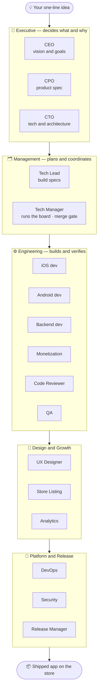
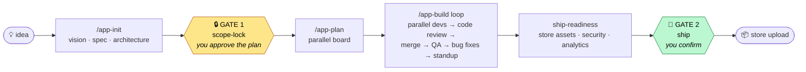
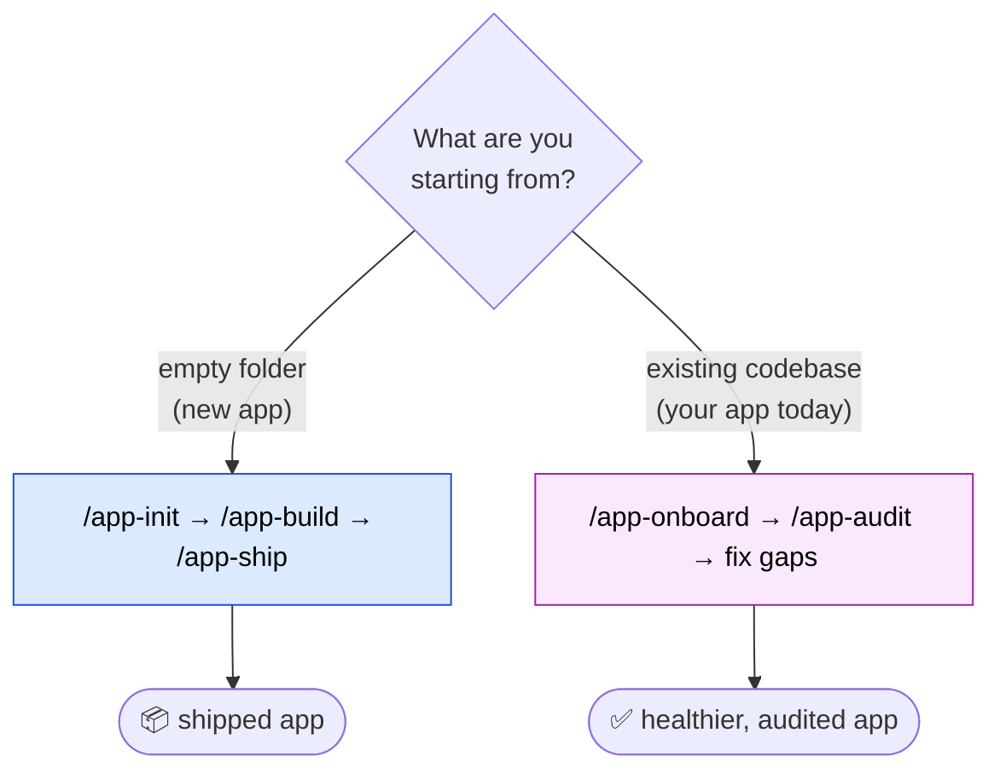

<div align="center">

# 🏗️ AI App Studio

**Describe your app idea in one line. Get a shipped iOS & Android app.**

AI App Studio is a *team* of 17 AI specialists — a CEO, product manager, designers, iOS/Android
engineers, a code reviewer, QA, and a release manager — that works like a real software studio.
It takes your idea from **scope → design → code → review → store**, building in parallel, reviewing
and fixing its own work, and stopping for you at only the two moments that matter:
**what we're building** and **whether to ship**.

[](./CHANGELOG.md)
[](./LICENSE)
[]()
[]()

*Ships as the **`app-dev-team`** Claude Code plugin — see [Install](#install).*

</div>

---

## 30-second version

```
# In Claude Code, from an empty folder:
/app-run "A habit tracker for new parents, iOS + Android, freemium"
```

That one command spins up the whole studio. It pauses **once** so you can approve the plan, then
builds the app autonomously — parallel engineers, automated code review, QA, and a bug-fix loop —
giving you a short standup after each round, and pauses **again** only when it's ready to ship.

Already have an app? Point it at your existing code instead and it works in reverse — reads the
codebase, grades it against professional standards, and closes the gaps:

```
/app-onboard      # understand the existing app
/app-audit        # score it, list the issues, fix them
```

---

## What it actually does

Most "AI builds your app" tools are a **single agent improvising** — it writes some code, forgets
the plan, and leaves you to be the project manager. Real apps aren't built that way. They're built
by a **team** with roles, handoffs, conventions, and a review gate.

AI App Studio models that team. Each role is a focused AI specialist that does one job well and
hands off to the next:



The engineers work **in parallel**. The code reviewer is a real gate — nothing merges until it
passes (and on iOS it runs ~25 specialist auditors for accessibility, concurrency, security, and
more). QA files bugs, the team fixes them in a loop, and you get a daily standup the whole way.

---

## How it runs — the autonomy model

You stay in control at exactly two gates. Everything between them runs on its own.



**"Mostly autonomous" means it shows you the seams.** It never invents intent when a requirement is
ambiguous — it writes the blocker into the standup and surfaces it to you verbatim, instead of
guessing and building the wrong thing.

### Two ways in: new app or existing app



`/app-run` auto-detects which path you're on, so you can always just start there.

---

## Use cases — who this is for

| You are… | You use it to… |
|---|---|
| 🚀 **An indie founder / solopreneur** | Turn an idea into a real, store-ready iOS + Android app without hiring a team — and without being the project manager. |
| 🧑‍💻 **A developer who's stretched thin** | Offload the scaffolding, boilerplate, store setup, and the boring-but-critical review/QA passes, so you focus on the hard parts. |
| 🏢 **A small studio shipping many apps** | Encode your house conventions once; every new app comes out in *your* style, not generic AI defaults — and the studio improves after each ship. |
| 🛠️ **A team with an existing app** | Onboard the codebase, audit it against professional standards (accessibility, security, performance, store readiness), and get a prioritized fix list. |
| 📚 **Someone learning to build apps** | Watch a structured team make decisions — read the vision, PRD, architecture, and reviews it writes, like a senior team thinking out loud. |
| ⏱️ **Anyone validating an idea fast** | Go from "what if there was an app that…" to a working build you can put in front of users. |

---

## Why this helps

- **You don't have to be the project manager.** The studio drives itself. You give the idea, approve
  the plan, and confirm the ship — it handles the 100 steps in between.
- **It catches its own mistakes.** Code is reviewed before it merges, QA files bugs, and the team
  fixes them in a loop. On iOS, ~25 specialist auditors check accessibility, data races, security,
  memory, and App Store rejection risks automatically.
- **It builds it the right way, not just *a* way.** A built-in **House Knowledge Base** encodes
  proven architecture, monetization, analytics, and store conventions — so output is production-grade,
  not a throwaway prototype.
- **It's honest about ambiguity.** When something is unclear, it stops and asks instead of guessing —
  so you never discover three days later that it built the wrong thing.
- **It's transparent.** Every decision is written to plain Markdown docs (vision, PRD, architecture,
  reviews, standups). Nothing is a black box; you can read, edit, or override any of it.

## Why it's better than a single AI agent

| | 🤖 One AI agent improvising | 🏗️ **AI App Studio** |
|---|---|---|
| **Structure** | One context doing everything; forgets the plan | 17 focused roles with clear handoffs and ownership |
| **Code review** | None — it ships whatever it wrote | A real review gate; nothing merges until it passes |
| **Quality bar** | Generic AI defaults | Your house conventions + ~25 iOS specialist auditors |
| **Parallelism** | Sequential, slow | Engineers build features in parallel |
| **Ambiguity** | Guesses and moves on | Stops, writes the blocker, asks you |
| **Existing apps** | Starts from scratch | Onboards, audits, and remediates what you already have |
| **Memory** | Forgets between steps | Shared Markdown docs are the team's long-term memory |
| **Gets better** | Same every time | Living knowledge base improves after each shipped app |
| **Dependencies** | Varies | Zero — pure Claude Code, clone and run |

---

## Install

This repo is its own Claude Code **marketplace**, so installing is two commands. Inside Claude Code:

```
/plugin marketplace add vmobifystudio/app-dev-team
/plugin install app-dev-team@mobify-studio
```

> 💡 **AI App Studio** is the friendly name for the **`app-dev-team`** plugin — that's the ID you
> install and the command prefix (`/app-*`) you'll use.

The plugin is enabled automatically — its 17 agents, 11 commands, and skills are now available.
Run `/plugin` anytime to browse, enable/disable, or remove it. To update later, re-run
`/plugin marketplace add vmobifystudio/app-dev-team` and reinstall.

<details>
<summary>Other install methods</summary>

**A specific version/branch** — append a git ref:
```
/plugin marketplace add vmobifystudio/app-dev-team@main
```

**Local clone (for hacking on it)** — point Claude Code at a local checkout:
```bash
git clone https://github.com/vmobifystudio/app-dev-team
```
```
/plugin marketplace add ./app-dev-team
/plugin install app-dev-team@mobify-studio
```

`/plugin marketplace add` also accepts a full git URL (`https://…/app-dev-team.git`) for non-GitHub hosts.
</details>

---

## Quickstart

```
# From the root of a new (empty) project directory, in Claude Code:

/app-run "A habit tracker for new parents, iOS + Android, freemium"
```

`/app-run` drives the whole thing. It pauses once for **scope-lock** (approve the vision + PRD +
architecture), then runs the sprint autonomously — parallel devs → code review → merge → QA → bug
loop — streaming a standup after each round, and pauses again only at **ship**.

Prefer to drive manually? Use the granular commands below.

### Already have an app? (brownfield)

Point it at an existing codebase and it works the other direction — read the code, grade it against
your standards, and close the gaps:

```
# from your existing app's repo root, in Claude Code:
/app-onboard          # detect stack, reverse-engineer as-built architecture + CLAUDE.md
/app-audit            # score vs the House KB + Axiom auditors → gap report → remediation backlog
```

`/app-audit` ranks every finding by severity **and the exact house rule it violates**, then builds a
remediation backlog and pauses so you choose what to fix. **Safe fixes** (accessibility, tokens,
localization, lint, missing analytics) are automated; **risky changes** (migrations, refactors,
concurrency rewrites, billing logic) get a written plan and only proceed with your approval.
`/app-run` does this automatically when it detects a non-empty app directory.

---

## The roster (17 agents)

| Layer | Agent | Owns |
|---|---|---|
| **Exec** | `ceo` | Vision, success metrics, scope |
| | `cpo` | PRD, user stories, backlog |
| | `cto` | Architecture & stack (starts from the House KB defaults) |
| **Management** | `tech-lead` | Per-platform impl specs, reusable patterns |
| | `tech-manager` | Sprint board, parallel coordination, standups, **merge gate** |
| **Engineering** | `ios-developer` | SwiftUI — routes through Axiom iOS skills (parallel) |
| | `android-developer` | Compose/Material 3 (parallel) |
| | `backend-developer` | API + persistence (when in scope) |
| | `monetization-engineer` | StoreKit/Play Billing IAP, paywall gateway, AdMob + consent |
| | `code-reviewer` | The gate — runs **Axiom auditor agents** on iOS branches |
| | `qa-engineer` | Test plans, bug filing, ship sign-off |
| **Design & Growth** | `ux-designer` | Flows, design tokens, component inventory |
| | `aso-specialist` | Store listing, keywords, screenshots, readiness gate |
| | `data-analyst` | Analytics schema, instrumentation check, post-launch KPIs |
| **Platform & Release** | `devops-engineer` | Git strategy, CI, signing, flavors, secrets hygiene |
| | `security-reviewer` | Pre-ship MASVS pass, severity-classified findings |
| | `release-manager` | Versioning, signing, store upload, release notes |

Every build agent invokes the `house-conventions` skill before working. Roles are just Markdown
files — add, remove, or retune them.

## Commands

| Command | What it does |
|---|---|
| `/app-run [idea]` | **The autonomous driver** — auto-detects greenfield vs existing app, then init/onboard → gate → sprint loop → ship-readiness. `--yolo` skips the gate; wrap in `/loop` for hands-off pacing. |
| `/app-init [idea]` | **(New app)** Intake → CEO vision → parallel CPO/CTO → parallel ux/tech-lead/devops → bootstraps the project `CLAUDE.md`, `.gitignore`, and git strategy. |
| `/app-onboard [path]` | **(Existing app)** Detect the stack, reverse-engineer the as-built architecture + feature inventory, generate `CLAUDE.md` — so the team understands the codebase. |
| `/app-audit [dimension]` | **(Existing app)** Grade it against the House KB + Axiom auditors → severity-ranked gap report (`docs/80-audit.md`) → remediation backlog → gate → fix (safe auto, risky on approval). |
| `/app-plan [focus]` | Tech-manager turns backlog + specs into a parallel-friendly board. |
| `/app-build [tickets]` | Spawns devs/reviewers/QA in parallel; streams reviews; gates merges; loops the bug fixes. 2-cycle review cap. |
| `/app-review <branch>` | Code review on a single branch. |
| `/app-ship [version]` | Parallel security + ASO + analytics readiness → release-manager. Confirms before any upload. |
| `/app-status` | Vision, sprint goal, board summary, blockers, latest standup. |
| `/app-learn <app paths>` | Mines a shipped app's conventions into the **living** House KB; flags conflicts for your decision. |
| `/app-team` | Lists the roster. |

## The House Knowledge Base (`knowledge/`)

Mined from our internal shipped apps, this is the studio's accumulated taste — the architecture,
monetization, analytics, and store conventions that make output production-grade instead of generic.
Every build agent reads the relevant pack first:

| Pack | Encodes |
|---|---|
| `stack-defaults.md` | Default languages, versions, libraries, SDK targets |
| `ios-conventions.md` | Layering, Display DTOs, Swift 6 concurrency rules, DI, tokens, a11y |
| `android-conventions.md` | Clean Architecture modules, the 5 ViewModel patterns, Room/DataStore |
| `monetization.md` | Two-door paywall gateway, StoreKit/Play Billing, AdGate, consent |
| `analytics.md` | Consent-gated events, PII rules, funnels, retention |
| `aso.md` | Screenshot automation, Play Data Safety, store-readiness gate |
| `git-workflow.md` | Branch model, commit conventions, versioning, CI, secrets |

It's **living** — `/app-learn` folds new learnings from each shipped app back in, and flags
conflicts (it never silently overwrites a convention).

## What it leverages on your machine

The plugin is dependency-free, but gets dramatically better when these are installed (they're
soft-routed — absent ones degrade gracefully to the House KB defaults):

- **Axiom iOS** skills + auditor agents — the iOS team's primary toolkit and review gate.
- **ui-design** (`mobile-android-design`, `mobile-ios-design`, …) and **ui-ux-pro-max**.
- **aso-screenshots** and **admob-android-integration**.

## File layout the team creates in your project

```
CLAUDE.md                    project conventions (seeded from the House KB)
docs/
  00-vision · 01-intake · 10-prd · 11-backlog
  12-flows · 13-design-tokens · 14-components · 15-aso
  20-architecture · 21-engineering-principles · 22-impl-spec-{ios,android,backend}
  23-git-strategy · 40-api · 41-monetization
  50-test-plan · 51-bugs · 52-analytics
  60-releases · 70-security-review
  80-audit.md                  (brownfield: gap report vs the House KB)
  daily/standup-YYYY-MM-DD.md
ios/   android/   backend/   (per scope)
```

## Tuning

- **Pod size** defaults to 3 engineers; the tech-manager scales it at sprint planning.
- **Roles are files** in `agents/` — edit, add (e.g. `ml-engineer`), or remove.
- **Stack defaults** live in `knowledge/stack-defaults.md` — change them once, every project follows.
- **Autonomy** — `/app-run --yolo` to skip scope-lock; `/loop /app-run …` for fully self-paced runs.

## Philosophy

It is not a robot you turn on and walk away from. It is a structured team that drafts most of the
work, holds itself to your conventions, reviews and fixes its own code, and shows you the seams at
the two moments that actually need a human: **what we're building**, and **whether to ship it**.

## Contributing

See [CONTRIBUTING.md](./CONTRIBUTING.md). Everything here is Markdown — no build step.

## License

[MIT](./LICENSE) © Mobify Studio
