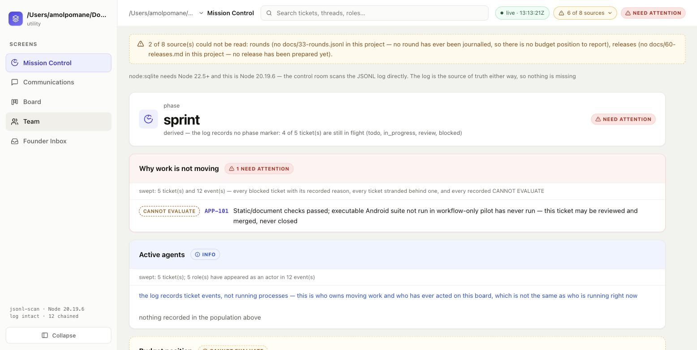
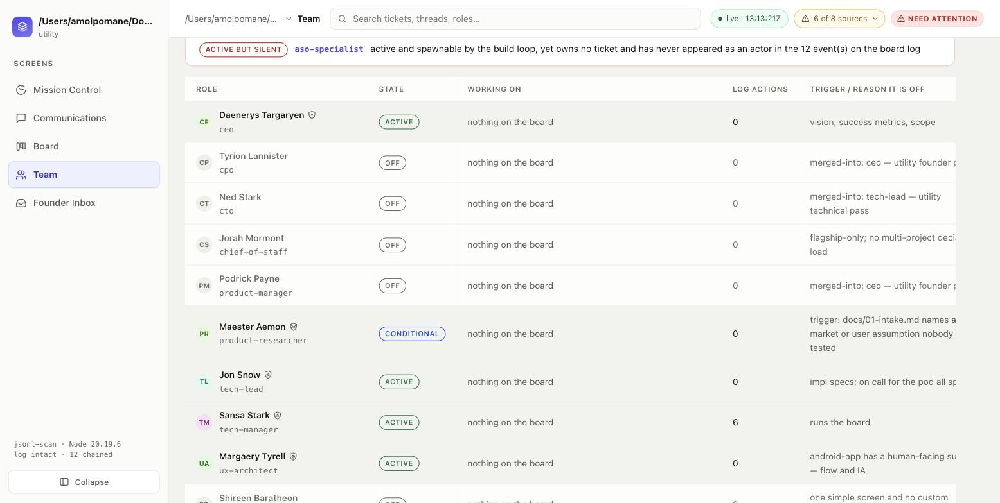
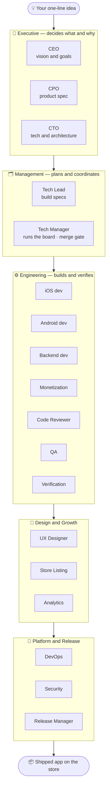
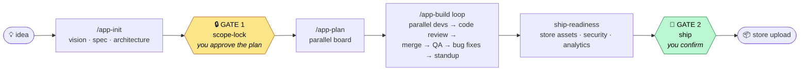
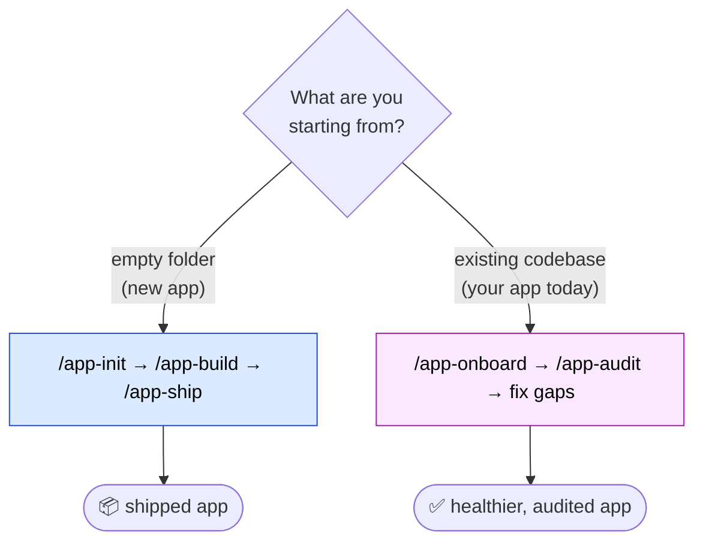

<div align="center">

# 🏗️ AI App Studio

**Describe your app idea in one line. Get a shipped iOS & Android app.**

AI App Studio is a *team* of 30 AI specialists — a CEO, product manager, designers, iOS/Android
engineers, a code reviewer, QA, and a release manager — that works like a real software studio.
It takes your idea from **scope → design → code → review → store**, building in parallel, reviewing
and fixing its own work, and stopping for you at only the two moments that matter:
**what we're building** and **whether to ship**.

[](./CHANGELOG.md)
[](./LICENSE)
[]()
[]()

*Ships as the **`app-dev-team`** Claude Code plugin — see [Install](#install).*

</div>

<p align="center">
  
  
</p>
<p align="center"><i>The <a href="#watch-it-work-the-control-room">control room</a> — a live, read-only dashboard over the team's own append-only log.</i></p>

---

## 30-second version

```
# In Claude Code, from an empty folder:
/app-run "A habit tracker for new parents, iOS + Android, freemium"
```

That one command spins up the whole studio. It pauses **once** so you can approve the plan, then
builds the app autonomously — parallel engineers, automated code review, QA, and a bug-fix loop —
giving you a short standup after each round, and pauses **again** only when it's ready to ship.

Already have an app? Point it at your existing code instead and it works in reverse — reads the
codebase, grades it against professional standards, and closes the gaps:

```
/app-onboard      # understand the existing app
/app-audit        # score it, list the issues, fix them
```

---

## What it actually does

Most "AI builds your app" tools are a **single agent improvising** — it writes some code, forgets
the plan, and leaves you to be the project manager. Real apps aren't built that way. They're built
by a **team** with roles, handoffs, conventions, and a review gate.

AI App Studio models that team. Each role is a focused AI specialist that does one job well and
hands off to the next:


```mermaid
flowchart TD
    idea([💡 Your one-line idea])

    subgraph EXEC["🎩 Executive — decides what and why"]
        direction LR
        CEO[CEO<br/>vision and goals]
        CPO[CPO<br/>product spec]
        CTO[CTO<br/>tech and architecture]
    end

    subgraph MGMT["🗂️ Management — plans and coordinates"]
        direction LR
        TL[Tech Lead<br/>build specs]
        TM[Tech Manager<br/>runs the board · merge gate]
    end

    subgraph ENG["⚙️ Engineering — builds and verifies"]
        direction LR
        IOS[iOS dev]
        AND[Android dev]
        BE[Backend dev]
        MON[Monetization]
        REV[Code Reviewer]
        QA[QA]
        VER[Verification]
    end

    subgraph GROW["🎨 Design and Growth"]
        direction LR
        UX[UX Designer]
        ASO[Store Listing]
        DATA[Analytics]
    end

    subgraph REL["🚀 Platform and Release"]
        direction LR
        OPS[DevOps]
        SEC[Security]
        RM[Release Manager]
    end

    idea --> EXEC --> MGMT --> ENG --> GROW --> REL --> ship([📦 Shipped app on the store])
```

The engineers work **in parallel**. The code reviewer is a real gate — nothing merges until it
passes (and on iOS it runs ~25 specialist auditors for accessibility, concurrency, security, and
more). QA files bugs, the team fixes them in a loop, and you get a daily standup the whole way.

---

## How it runs — the autonomy model

You stay in control at exactly two gates. Everything between them runs on its own.


```mermaid
flowchart LR
    A([💡 idea]) --> B["/app-init<br/>vision · spec · architecture"]
    B --> G1{{"🔒 GATE 1<br/>scope-lock<br/><i>you approve the plan</i>"}}
    G1 --> C["/app-plan<br/>parallel board"]
    C --> D["/app-build loop<br/>parallel devs → code review →<br/>merge → QA → bug fixes → standup"]
    D --> E["ship-readiness<br/>store assets · security · analytics"]
    E --> G2{{"🚀 GATE 2<br/>ship<br/><i>you confirm</i>"}}
    G2 --> F([📦 store upload])

    style G1 fill:#fde68a,stroke:#b45309,color:#000
    style G2 fill:#bbf7d0,stroke:#15803d,color:#000
```

**"Mostly autonomous" means it shows you the seams.** It never invents intent when a requirement is
ambiguous — it writes the blocker into the standup and surfaces it to you verbatim, instead of
guessing and building the wrong thing.

### Board integrity — the loop can't quietly drop work

The board is the team's only memory across agent invocations, and every row is written by an agent
editing a Markdown table. So two checks run mechanically rather than on trust:

- **Board doctor** (`scripts/board-doctor.mjs`) runs before *any* agent is spawned, every round.
  It catches the failure the loop is structurally blind to: a ticket whose dependency is `blocked`
  is never "ready" and never in review, so the sprint would otherwise **exit and report success
  without ever mentioning it**. It also catches missing/invalid owners, broken and circular
  dependencies, self-review, tickets that reached `qa`/`done` without an approval on record, and a
  breached review-cycle cap. Anomalies stop the loop; nothing spawns until the board is repaired.
- **DONE verification** (`scripts/verify-done.sh`) checks a developer's `DONE: APP-NNN` against git
  before the row moves to review — branch exists, commits are actually there, files changed, and
  the test command exits zero. A self-reported "tests: all green" is never taken at face value.
- **Review verdict enforcement** (`hooks/require-review-verdict.sh`) is a Claude Code `SubagentStop`
  hook: a `code-reviewer` subagent cannot stop until the board's own event log shows a real
  `approved`/`changes` verdict it recorded, or a documented `BLOCKED` refusal. Found live, on this
  plugin's own PR review: a reviewer went idle three times, producing nothing, and two nudges didn't
  change that. The first version of this hook checked the *agent's own transcript* for the right
  words — an independent review reproduced that a transcript merely *quoting* the required command
  satisfied it with zero work done. It now checks the append-only log directly; a false claim can't
  forge a real log line the way it can forge a sentence.
- **Base-vs-head regression check** (`scripts/wave-integrate.mjs --check-baseline`) — on a failed
  wave, checks whether the unmodified integration branch *also* fails the same suite before blaming
  the tickets in it. Opt-in and additive: it changes nothing about a green wave, and never turns a
  real failure into a pass — it only tells you whether the failure pre-dates the wave.

Every gate above is plain Node + POSIX `sh` with no dependencies, and the `board-doctor` skill
carries a manual checklist so a vanilla install without Node still performs the check by hand.

### How the agents coordinate

Agents don't shout into one shared room, and they don't route every sentence through a human.

- **Isolation.** Every writing agent gets its **own git worktree**, created before it is spawned.
  Without this, parallel agents corrupt each other — measured, not theorised: a dry run of two
  *deliberately independent* tickets in one tree produced a commit containing the other ticket's
  half-written files, one agent burning ~50% of its budget discovering and redoing work it had
  already done correctly, and two branches with add/add conflicts on **all 8 files**.
  ([full write-up](docs/research/2026-07-29-dry-run-parallel-agent-collision.md))
- **A real channel.** `docs/team/messages.jsonl` is an append-only event log — `question`, `answer`,
  `handoff`, `blocker`, `escalation`, `decision` — so an IC can ask the tech lead one question and
  keep working, instead of hard-blocking and paying for a full re-spawn. `docs/team/messages.md` is
  its generated view; channels and threads are queries over the log, never places state is written.
- **Messages that have to produce something.** Every material message must yield a decision, a state
  transition, an artifact update or a timed follow-up, or it is refused at send time. An `answer`
  that names no artifact is refused too: a closed ledger is not delivery.
- **An anti-ping-pong guard.** Two agents can burn a whole budget agreeing with each other, so the
  send helper enforces limits: 10 messages per role per round, 2 per pair per ticket, 4 roles per
  chain, 12 per ticket, no duplicate question, no reopening a decided thread without new evidence.
  Breach one and you must escalate to the tech manager instead of re-sending.
- **Parallelism judged on files, not features.** Two tickets that touch the same file are
  serialized however unrelated they look on the board.

### Seeing the state

```bash
node scripts/board-render.mjs docs/31-board.md --out docs/32-board-view.md
```

A terminal kanban, per-owner load, a NEEDS ATTENTION block, and a Mermaid dependency graph that
renders on GitHub — with stranded and blocked tickets outlined in red. `/app-status` prints it;
`/app-build` regenerates it each round.

### Reviews that find real defects

The reviewer no longer just reads a diff. It applies the `defect-hunting` skill, mined from a real
remediation programme where twelve screen-by-screen review rounds found nothing new and one round
organised by **data path** found dozens of live defects:

- **The second write path.** In every miss, the reviewed surface was correct and the bug was
  elsewhere — add validated but edit didn't; the reader was fixed and the writer destroyed data;
  the picker's success branch was right and its cancel branch wiped the photo. The reviewer must
  enumerate every writer and reader of the data a diff touches.
- **Execute constants, never certify by reading.** A plausibility envelope that read perfectly and
  survived 35 sprints rejected the *median* subject at 26 of 61 ages. Mis-calibration is invisible
  to inspection because the code is correct.
- **A rule that cannot fail is worse than no rule.** Ten of nineteen real guard rules were
  bypassable, all from `contains()` over prose — one was tripped by its own comment. New rules must
  be watched failing before they are trusted.

`verification-engineer` owns this at release time and gates `/app-ship`.

Two more additions to the review itself: it now exercises a ticket's acceptance criteria **black-box,
before opening the diff** — running the actual behavior rather than reading the code first, so the
reviewer isn't reasoning from the same source that may have produced the bug. And how much ceremony a
review carries scales with the ticket's own size (`process-tiering`, XS through XL) — a one-line fix
doesn't walk the same process as a multi-screen feature, except nothing ever lightens for a ticket
touching auth, payments, PII, or anything `security-reviewer` owns, regardless of size.

### The team checks itself

```bash
node scripts/team-doctor.mjs
```

`board-doctor` validates a project's board. `team-doctor` validates the **team definition** — the
gaps that are invisible by construction: a role nothing ever spawns, a role that can own a ticket
but that `/app-build` never launches (the ticket is never picked up *and* never reported), a
referenced skill that doesn't exist, a handoff pointing at nobody, a doc one role writes that no
role reads. Each of those was a live defect found by hand once.

### Two ways in: new app or existing app


```mermaid
flowchart TD
    Q{What are you<br/>starting from?}
    Q -->|"empty folder<br/>(new app)"| GF["/app-init → /app-build → /app-ship"]
    Q -->|"existing codebase<br/>(your app today)"| BF["/app-onboard → /app-audit → fix gaps"]
    GF --> S([📦 shipped app])
    BF --> S2([✅ healthier, audited app])

    style GF fill:#dbeafe,stroke:#1d4ed8,color:#000
    style BF fill:#fae8ff,stroke:#a21caf,color:#000
```

`/app-run` auto-detects which path you're on, so you can always just start there.

---

## Watch it work: the control room

A live, read-only dashboard over the team's own append-only log — the same view a founder uses to
watch the sprint instead of reading raw JSONL. Five screens: **Mission Control** (cause before
consequence — why work isn't moving, budget position, active agents), **Communications** (real
per-ticket threads, not narrated chatter), **Board** (kanban + per-owner load + the metrics that
back it), **Team** (every role's real state and reason, GoT nicknames included), **Founder Inbox**
(the three things a decision needs: context, recommendation, one whitelisted action).

It never invents a number: a section it can't evaluate says so — dashed border, amber, `CANNOT
EVALUATE` — instead of rendering an empty list that reads as "all clear." Zero runtime dependencies
beyond React itself; it lives in `control-room/` with its own `package.json` so the plugin stays
dependency-free.

```bash
cd control-room && npm install && npm run build
node server.mjs --project /path/to/your/project --port 4174   # open http://localhost:4174
```

See [`control-room/README.md`](control-room/README.md) for live-development mode (hot reload on
`:5174`, proxied to the data plane on `:4174`).

---

## Use cases — who this is for

| You are… | You use it to… |
|---|---|
| 🚀 **An indie founder / solopreneur** | Turn an idea into a real, store-ready iOS + Android app without hiring a team — and without being the project manager. |
| 🧑‍💻 **A developer who's stretched thin** | Offload the scaffolding, boilerplate, store setup, and the boring-but-critical review/QA passes, so you focus on the hard parts. |
| 🏢 **A small studio shipping many apps** | Encode your house conventions once; every new app comes out in *your* style, not generic AI defaults — and the studio improves after each ship. |
| 🛠️ **A team with an existing app** | Onboard the codebase, audit it against professional standards (accessibility, security, performance, store readiness), and get a prioritized fix list. |
| 📚 **Someone learning to build apps** | Watch a structured team make decisions — read the vision, PRD, architecture, and reviews it writes, like a senior team thinking out loud. |
| ⏱️ **Anyone validating an idea fast** | Go from "what if there was an app that…" to a working build you can put in front of users. |

---

## Why this helps

- **You don't have to be the project manager.** The studio drives itself. You give the idea, approve
  the plan, and confirm the ship — it handles the 100 steps in between.
- **It catches its own mistakes.** Code is reviewed before it merges, QA files bugs, and the team
  fixes them in a loop. On iOS, ~25 specialist auditors check accessibility, data races, security,
  memory, and App Store rejection risks automatically.
- **It builds it the right way, not just *a* way.** A built-in **House Knowledge Base** encodes
  proven architecture, monetization, analytics, and store conventions — so output is production-grade,
  not a throwaway prototype.
- **It's honest about ambiguity.** When something is unclear, it stops and asks instead of guessing —
  so you never discover three days later that it built the wrong thing.
- **It's transparent.** Every decision is written to plain Markdown docs (vision, PRD, architecture,
  reviews, standups). Nothing is a black box; you can read, edit, or override any of it.

## Why it's better than a single AI agent

| | 🤖 One AI agent improvising | 🏗️ **AI App Studio** |
|---|---|---|
| **Structure** | One context doing everything; forgets the plan | 18 focused roles with clear handoffs and ownership |
| **Code review** | None — it ships whatever it wrote | A real review gate; nothing merges until it passes |
| **Quality bar** | Generic AI defaults | Your house conventions + ~25 iOS specialist auditors |
| **Parallelism** | Sequential, slow | Engineers build features in parallel |
| **Ambiguity** | Guesses and moves on | Stops, writes the blocker, asks you |
| **Existing apps** | Starts from scratch | Onboards, audits, and remediates what you already have |
| **Memory** | Forgets between steps | Shared Markdown docs are the team's long-term memory |
| **Gets better** | Same every time | Living knowledge base improves after each shipped app |
| **Dependencies** | Varies | Zero — pure Claude Code, clone and run |

---

## Install

This repo is its own Claude Code **marketplace**, so installing is two commands. Inside Claude Code:

```
/plugin marketplace add vmobifystudio/app-dev-team
/plugin install app-dev-team@mobify-studio
```

> 💡 **AI App Studio** is the friendly name for the **`app-dev-team`** plugin — that's the ID you
> install and the command prefix (`/app-*`) you'll use.

The plugin is enabled automatically — its 18 agents, 11 commands, and skills are now available.
Run `/plugin` anytime to browse, enable/disable, or remove it. To update later, re-run
`/plugin marketplace add vmobifystudio/app-dev-team` and reinstall.

<details>
<summary>Other install methods</summary>

**A specific version/branch** — append a git ref:
```
/plugin marketplace add vmobifystudio/app-dev-team@main
```

**Local clone (for hacking on it)** — point Claude Code at a local checkout:
```bash
git clone https://github.com/vmobifystudio/app-dev-team
```
```
/plugin marketplace add ./app-dev-team
/plugin install app-dev-team@mobify-studio
```

`/plugin marketplace add` also accepts a full git URL (`https://…/app-dev-team.git`) for non-GitHub hosts.
</details>

---

## Quickstart

```
# From the root of a new (empty) project directory, in Claude Code:

/app-run "A habit tracker for new parents, iOS + Android, freemium"
```

`/app-run` drives the whole thing. It pauses once for **scope-lock** (approve the vision + PRD +
architecture), then runs the sprint autonomously — parallel devs → code review → merge → QA → bug
loop — streaming a standup after each round, and pauses again only at **ship**.

Prefer to drive manually? Use the granular commands below.

### Already have an app? (brownfield)

Point it at an existing codebase and it works the other direction — read the code, grade it against
your standards, and close the gaps:

```
# from your existing app's repo root, in Claude Code:
/app-onboard          # detect stack, reverse-engineer as-built architecture + CLAUDE.md
/app-audit            # score vs the House KB + Axiom auditors → gap report → remediation backlog
```

`/app-audit` ranks every finding by severity **and the exact house rule it violates**, then builds a
remediation backlog and pauses so you choose what to fix. **Safe fixes** (accessibility, tokens,
localization, lint, missing analytics) are automated; **risky changes** (migrations, refactors,
concurrency rewrites, billing logic) get a written plan and only proceed with your approval.
`/app-run` does this automatically when it detects a non-empty app directory.

---

## The roster (18 agents)

| Layer | Agent | Owns |
|---|---|---|
| **Exec** | `ceo` | Vision, success metrics, scope |
| | `cpo` | PRD, user stories, backlog |
| | `cto` | Architecture & stack (starts from the House KB defaults) |
| **Management** | `tech-lead` | Per-platform impl specs, reusable patterns |
| | `tech-manager` | Sprint board, parallel coordination, standups, **merge gate** |
| **Engineering** | `ios-developer` | SwiftUI — routes through Axiom iOS skills (parallel) |
| | `android-developer` | Compose/Material 3 (parallel) |
| | `backend-developer` | API + persistence (when in scope) |
| | `monetization-engineer` | StoreKit/Play Billing IAP, paywall gateway, AdMob + consent |
| | `code-reviewer` | The gate — runs **Axiom auditor agents** on iOS branches |
| | `qa-engineer` | Test plans, bug filing, ship sign-off |
| | `verification-engineer` | **Executes** what everyone else asserts — constants, guard rules, agent reports |
| **Design & Growth** | `ux-architect` | Information architecture, navigation, flows, screen-and-state inventory |
| | `product-designer` | Screen composition, hierarchy, interaction, tokens, components |
| | `aso-specialist` | Store listing, keywords, screenshots, readiness gate |
| | `data-analyst` | Analytics schema, instrumentation check, post-launch KPIs |
| **Platform & Release** | `devops-engineer` | Git strategy, CI, signing, flavors, secrets hygiene |
| | `security-reviewer` | Pre-ship MASVS pass, severity-classified findings |
| | `release-manager` | Versioning, signing, store upload, release notes |

Every build agent invokes the `house-conventions` skill before working, plus `agent-isolation`
(its own git worktree) and `team-protocol` (how it talks to the rest of the team). Roles are just
Markdown files — add, remove, or retune them.

The 18 above are the roles you'll spawn on a typical build; `agents/` holds 30 in total — the rest
(`chief-of-staff`, `web-developer`, `test-automation-engineer`, `red-team-agent`,
`product-manager`, `product-researcher`, `product-validator`, `release-auditor`,
`privacy-reviewer`, `incident-commander`, `reliability-engineer`) activate conditionally, per
`docs/02-team-roster.md`'s own recorded triggers. The control room's **Team** screen shows every
one of them, active or off, with the reason either way.

## Meet the studio 🐺🐉🦁

Purely for fun — the control room UI gives every role a Game of Thrones name and house sigil,
matched to what that role actually does in this system, not just picked at random. It's a
**display-only nickname**: the real identifier (`tech-lead`, `android-developer`, …) is what every
script, log line, board row, and git branch actually uses — nothing operational changes. Hover any
avatar in the control room, or open the **Team** tab, to see it live.

| House | Sigil | Role | Character | Why |
|---|---|---|---|---|
| Targaryen | 🐉 | `ceo` | **Daenerys Targaryen** | Sets the vision, makes the final call |
| Lannister | 🦁 | `cpo` | **Tyrion Lannister** | The sharpest strategist in the room |
| Stark | 🐺 | `cto` | **Ned Stark** | Principled architecture, no shortcuts |
| Targaryen | 🐉 | `chief-of-staff` | **Jorah Mormont** | Utterly loyal right hand |
| Stark | 🐺 | `tech-lead` | **Jon Snow** | Leads from the front, unblocks the pod |
| Stark | 🐺 | `tech-manager` | **Sansa Stark** | Grew into the sharp administrator who runs the board |
| Targaryen | 🐉 | `android-developer` | **Grey Worm** | Unsullied precision — executes exactly to spec |
| Stark | 🐺 | `ios-developer` | **Arya Stark** | Independent, resourceful, gets it done her own way |
| Stark | 🐺 | `backend-developer` | **Samwell Tarly** | Unglamorous, essential infrastructure work |
| Stark | 🐺 | `web-developer` | **Gilly** | Resourceful, adapts to whatever the environment needs |
| none | 🕷️ | `code-reviewer` | **Varys** | Sees the truth others miss, never rubber-stamps |
| errant | ⚔️ | `qa-engineer` | **Brienne of Tarth** | Holds everyone to their stated oath |
| Targaryen | 🐉 | `test-automation-engineer` | **Daario Naharis** | Precise and reliable, every time |
| none | 🕷️ | `verification-engineer` | **Maester Luwin** | Meticulous — certifies constants, proves guard rules can fail |
| errant | ⚔️ | `red-team-agent` | **Bronn** | Finds every weakness, fights dirty to win |
| none | 🐦 | `monetization-engineer` | **Petyr "Littlefinger" Baelish** | Money, coin, and schemes |
| Tyrell | 🌹 | `ux-architect` | **Margaery Tyrell** | Crafts the experience people fall in love with |
| Baratheon | 🦌 | `product-designer` | **Shireen Baratheon** | Patient, thoughtful, cares how things feel |
| errant | ⚔️ | `product-manager` | **Podrick Payne** | Quietly excellent, always delivers |
| none | 🕷️ | `product-researcher` | **Maester Aemon** | Ancient wisdom, digs into what's actually true |
| errant | ⚔️ | `product-validator` | **Yara Greyjoy** | Tests every plan ruthlessly before it sails |
| Targaryen | 🐉 | `aso-specialist` | **Missandei** | Translator — crafts the message for every audience |
| Stark | 🐺 | `data-analyst` | **Bran Stark** | The Three-Eyed Raven — sees all the data and patterns |
| Baratheon | 🦌 | `devops-engineer` | **Gendry** | The blacksmith — forges the pipeline everyone else uses |
| Baratheon | 🦌 | `release-manager` | **Davos Seaworth** | The onion knight — literally ships things |
| errant | ⚔️ | `release-auditor` | **Barristan Selmy** | Incorruptible, double-checks before it's final |
| errant | ⚔️ | `security-reviewer` | **Sandor "The Hound" Clegane** | Blunt protector, no sugarcoating |
| Stark | 🐺 | `privacy-reviewer` | **Howland Reed** | Keeper of the realm's biggest secret |
| errant | ⚔️ | `incident-commander` | **Beric Dondarrion** | Always answers when there's a fire to fight |
| Stark | 🐺 | `reliability-engineer` | **Brandon "the Builder" Stark** | Built the Wall to last eight thousand years |


## Commands

| Command | What it does |
|---|---|
| `/app-run [idea]` | **The autonomous driver** — auto-detects greenfield vs existing app, then init/onboard → gate → sprint loop → ship-readiness. `--yolo` skips the gate; wrap in `/loop` for hands-off pacing. |
| `/app-init [idea]` | **(New app)** Intake → CEO vision → parallel CPO/CTO → parallel ux/tech-lead/devops → bootstraps the project `CLAUDE.md`, `.gitignore`, and git strategy. |
| `/app-onboard [path]` | **(Existing app)** Detect the stack, reverse-engineer the as-built architecture + feature inventory, generate `CLAUDE.md` — so the team understands the codebase. |
| `/app-audit [dimension]` | **(Existing app)** Grade it against the House KB + Axiom auditors → severity-ranked gap report (`docs/80-audit.md`) → remediation backlog → gate → fix (safe auto, risky on approval). |
| `/app-plan [focus]` | Tech-manager turns backlog + specs into a parallel-friendly board. |
| `/app-build [tickets]` | Board-doctor gate → spawns devs/reviewers/QA in parallel → verifies each `DONE` against git → streams reviews → gates merges → loops the bug fixes. 2-cycle review cap. |
| `/app-review <branch>` | Code review on a single branch. |
| `/app-preflight [path] [--ticket APP-NNN]` | Verify repository context, dependencies, versions, policy evidence, and source-of-truth documents before work. |
| `/app-context` | Create or verify the explicit context manifest used by an execution attempt. |
| `/app-run-status` | Check durable run leases, checkpoints, and orphaned attempts. |
| `/app-recover` | Recover interrupted work through an explicit terminal ledger record. |
| `/app-memory` | Govern durable memory proposals, provenance, promotion, rejection, and contradictions. |
| `/app-eval` | Run deterministic role, policy, and workflow evaluation fixtures. |
| `/app-schedule` | Compute dependency-ready work with bounded parallelism and backpressure. |
| `/app-capabilities` | Enforce role operation and path capabilities from an allowlist. |
| `/app-impact` | Propagate changed-file review to declared downstream consumers. |
| `/app-risk` | Route work by blast radius, model tier, approvals, and required evidence. |
| `/app-incident` | Record operational incidents and release-health response. |
| `/app-manager-failover` | Inspect manager leases and decide HOLD, FAILOVER, or BLOCK. |
| `/app-manager-harness` | Compare warm and cold manager state contracts against the same scenario. |
| `/app-ship [version]` | Parallel security + ASO + analytics readiness → release-manager. Confirms before any upload. |
| `/app-status` | Vision, sprint goal, board doctor verdict, board summary, blockers, latest standup. |
| `/app-portfolio` | **(Many apps)** Ranks every registered project by **attention needed** — where should the next hour go? An unreadable project is reported as unreadable, never omitted. |
| `/app-learn <app paths>` | Mines a shipped app's conventions into the **living** House KB; flags conflicts for your decision. Its failure pass harvests findings into the failure corpus and flags any class that **recurred after its rule shipped**. |
| `/app-team` | Lists the roster. |

## The House Knowledge Base (`knowledge/`)

Mined from our internal shipped apps, this is the studio's accumulated taste — the architecture,
monetization, analytics, and store conventions that make output production-grade instead of generic.
Every build agent reads the relevant pack first:

| Pack | Encodes |
|---|---|
| `stack-defaults.md` | Default languages, versions, libraries, SDK targets |
| `ios-conventions.md` | Layering, Display DTOs, Swift 6 concurrency rules, DI, tokens, a11y |
| `android-conventions.md` | Clean Architecture modules, the 5 ViewModel patterns, Room/DataStore |
| `monetization.md` | Two-door paywall gateway, StoreKit/Play Billing, AdGate, consent |
| `analytics.md` | Consent-gated events, PII rules, funnels, retention |
| `aso.md` | Screenshot automation, Play Data Safety, store-readiness gate |
| `git-workflow.md` | Branch model, commit conventions, versioning, CI, secrets |
| `failure-corpus.md` | **The defect classes this codebase actually produces** — the tell a reviewer greps for, the dated instances, and the rule that now catches each one |

The operating skills also include `context-preflight`, `dependency-policy`, `policy-checker`, and
`git-pr-strategy`. These are invoked before implementation, dependency/toolchain changes, sensitive
reviews, and Git/PR lifecycle actions; they complement rather than duplicate `agent-isolation`,
`team-protocol`, `house-conventions`, `defect-hunting`, and `mutation-testing`.

It's **living** — `/app-learn` folds new learnings from each shipped app back in, and flags
conflicts (it never silently overwrites a convention).

Every pack but one learns from apps that **shipped**, which means the KB only ever learned from
success. `failure-corpus.md` is the other half: `code-reviewer` and `verification-engineer` run its
tells before improvising their own, because prior information about what goes wrong *here* beats a
generic checklist of what could go wrong anywhere. Its most valuable output is a class that recurs
**after its rule shipped** — `team-doctor` fails on that, because it is proof the rule does not work.

## What it leverages on your machine

The plugin is dependency-free, but gets dramatically better when these are installed (they're
soft-routed — absent ones degrade gracefully to the House KB defaults):

- **Axiom iOS** skills + auditor agents — the iOS team's primary toolkit and review gate.
- **ui-design** (`mobile-android-design`, `mobile-ios-design`, …) and **ui-ux-pro-max**.
- **aso-screenshots** and **admob-android-integration**.

## File layout the team creates in your project

```
CLAUDE.md                    project conventions (seeded from the House KB)
docs/
  00-vision · 01-intake · 10-prd · 11-backlog
  12-flows · 13-design-tokens · 14-components · 15-aso
  20-architecture · 21-engineering-principles · 22-impl-spec-{ios,android,backend}
  23-git-strategy · 40-api · 41-monetization
  50-test-plan · 51-bugs · 52-analytics
  60-releases · 70-security-review
  80-audit.md                  (brownfield: gap report vs the House KB)
  daily/standup-YYYY-MM-DD.md
ios/   android/   backend/   (per scope)
```

## Tuning

- **Pod size** defaults to 3 engineers; the tech-manager scales it at sprint planning.
- **Roles are files** in `agents/` — edit, add (e.g. `ml-engineer`), or remove.
- **Stack defaults** live in `knowledge/stack-defaults.md` — change them once, every project follows.
- **Autonomy** — `/app-run --yolo` to skip scope-lock; `/loop /app-run …` for fully self-paced runs.

## Philosophy

It is not a robot you turn on and walk away from. It is a structured team that drafts most of the
work, holds itself to your conventions, reviews and fixes its own code, and shows you the seams at
the two moments that actually need a human: **what we're building**, and **whether to ship it**.

## Contributing

See [CONTRIBUTING.md](./CONTRIBUTING.md). Everything here is Markdown — no build step.

## License

[MIT](./LICENSE) © Mobify Studio
